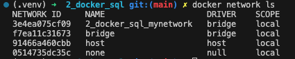

# Getting PGAdmin and Postgresql to run using docker compose

Everything was given to us, but I added networking details in `docker-compose.yaml`, then:

```bash
docker-compose up -d
```

Note: Sometimes docker can be a bit of a bitch setting up networking. In docker compose you can create a network by setting:

```
networks:
  mynetwork:
    driver: bridge
```

Which creates a network for you, however its not called that. It appends the container grouping name (Check out the docker containers tab after running compose up) before the network. This is very irritating to debug, but the following is your friend:

```bash
docker network ls
```

Running this shows your active networks, here we see the actual network name (2_docker_sql_mynetwork)... ffs:



WE HAVE A RRUNNING PGADMIN AND POSTGRESQL!!!!! WOOOHOOOO

When specifying both of these services we specified the network like so:

```
  pgadmin:
    networks:
      - mynetwork
```

These containers are now attached to the network, we can check this with:

```bash
docker network inspect 2_docker_sql_mynetwork
```

LOOK AT THOSE MOUNTED CONTAINERS TO THE NETWORK!!!!! AWWWW JIISSSSS BOOOIII

# Lets connect to those badboys

## POSTGRESQL

Where is postgress? Open it!!!!!

```bash
https://localhost:5432/
```

Lol you cant, its just a local DB and not Bigquery you dummy! Its oldschool we have to use some pgcli tool or something to get to it, but lets be cool and use the PGAdmin so you have the nice UI you are used to.

## PGADMIN

your using port 8080 and its on your local, thus the convention goes:

```bash
https://localhost:8080/
```
WTF is this, how we get here, why it works for pgadmin (This hosts a webserver)? https://chatgpt.com/share/678a581b-284c-8006-bb75-c25a4a52c497

Ok, we connect with:
```
email: admin@admin.com
password: root
```
as specidied in the docker compose file.

## PGADMIN connect to Postgresql

- Add new server
- General tab
  - Name: does_not_matter_what_i_name_my_server_group_server_group
- Connection tab
  - Host Name: pgdatabase (Go look where we named this in the dockerfile, take note)
  - Port: 5432 (As specified in dockerfile)
  - Username: root (As specified in dockerfile)
  - Password: root (As specified in dockerfile)

Now expand the database and go find the tables!!!! (Schemas -> Public -> Tables)

BUT HENCE THERE WERE NO TABLES!!!!!!!

# ADD taxi data

To do this we build a dockerfile (the same as provided) then run it with the following commands. Note I did change the ingest_data.py file in a very lazy manner to account for ingesting two different datasets. I trust in you to do this waaaayyyy smarter, anyways I build the container with: 

```bash
docker build -t taxi_ingest:v001 .
```

Then I execute the container twice with some different commands (once for ech dataset):

## TRIP DATA

```bash
URL="https://github.com/DataTalksClub/nyc-tlc-data/releases/download/yellow/yellow_tripdata_2021-01.csv.gz"

docker run -it \
  --network=2_docker_sql_mynetwork \
  taxi_ingest:v001 \
    --user=root \
    --password=root \
    --host=pgdatabase \
    --port=5432 \
    --db=ny_taxi \
    --table_name=yellow_taxi_trips \
    --url=${URL} \
    --trip_data=True
```

## TAXI ZONE DATA

```bash
URL="https://github.com/DataTalksClub/nyc-tlc-data/releases/download/misc/taxi_zone_lookup.csv"

docker run -it \
  --network=2_docker_sql_mynetwork \
  taxi_ingest:v001 \
    --user=root \
    --password=root \
    --host=pgdatabase \
    --port=5432 \
    --db=ny_taxi \
    --table_name=taxi_zone_lookup \
    --url=${URL}
```

# Now go do the stupid sql homework on the data yourself if you want to:

https://github.com/DataTalksClub/data-engineering-zoomcamp/blob/main/cohorts/2025/01-docker-terraform/homework.md


Next week we check out terraform!
